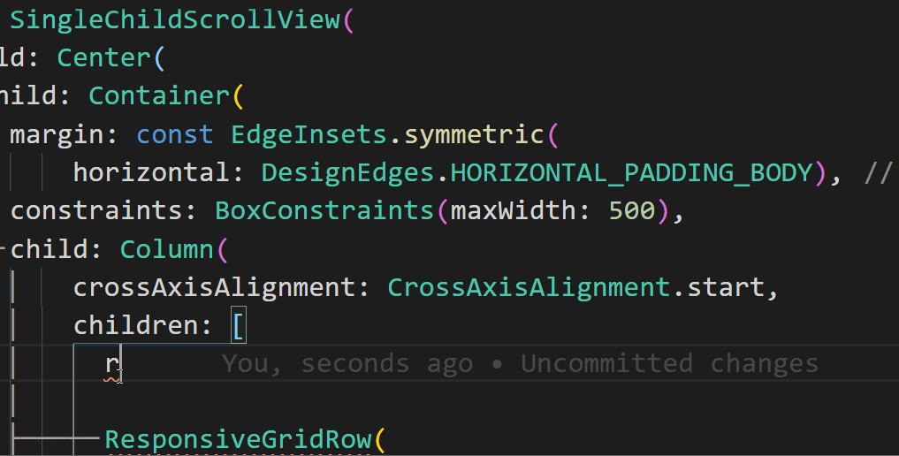

# bsresponsivegridsnippets README

bsresponsivegridsnippets is a set of snippets for

* [responsive_grid](https://pub.dev/packages/responsive_grid) for flutter.

## How to use

## Requirements

You must have the package added to your pubspec.yaml
* [responsive_grid](https://pub.dev/packages/responsive_grid)

## Extension Settings

Include the extension with
git clone https://github.com/ipolito21/bsresponsivegridsnippets.git.
in the C:\Users\UserName\.vscode\extensions folder

